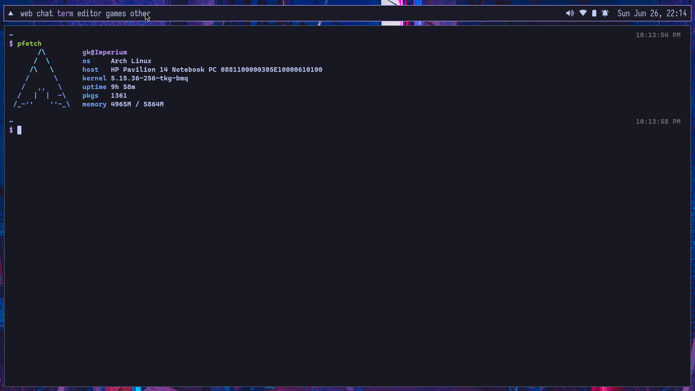
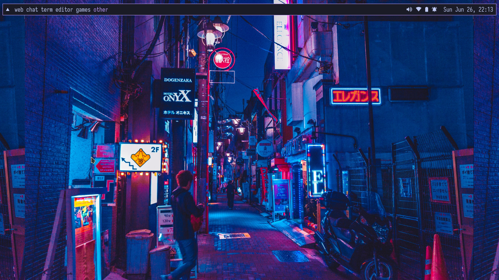
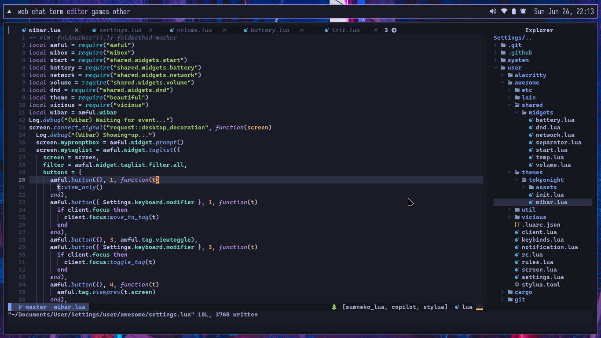

# Wow, you've just found my dotfiles!
 Welcome to my dotfiles, if you like, please drop a star :D
# About My System


- [Arch Linux](https://archlinux.org) The best distro
- [Awesome](https://awesomewm.org) The hackable window manager
- [Firefox](https://firefox.com) My favorite webbrowser
- [Lunarvim](https://lunarvim.org) The configuration for neovim for busy peoples
- [ZSH](https://www.zsh.org/) The Best shell
- [Alacritty](https://alacritty.org) The hyperfast terminal emulator
# Installation 
```sh
git clone --recursive https://github.com/yxqsnz/dotfiles.git yxqsnz.dots
cd yxqsnz.dots
pip3 install colorama
python3 dot.py
```
# Other Screenshots


