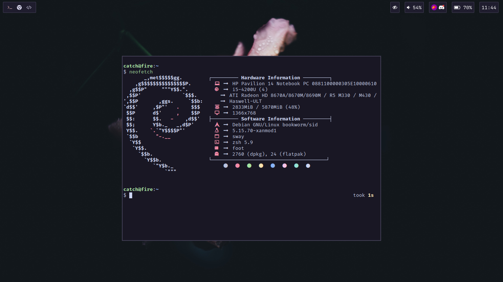

# My dotfiles!

## Infos
 - OS: [Debian Sid](https://wiki.debian.org/DebianUnstable)
 - Terminal: [Foot](https://codeberg.org/dnkl/foot)
 - Window Manager: [Sway](https://github.com/swaywm/sway)
 - Bar: [Waybar](https://github.com/Alexays/Waybar)
 - Editor: [Lunarvim](https://lunarvim.org)
